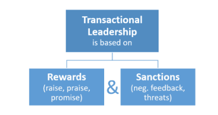

# Leadership and Team Development

## 1. Introduction
- Which leadership style is the most appropriate?
- Which leadership style is most prevalent in your organization?
- Why should my team follow my lead?
- How can I alter my competencies and behaviors to become this type of leader?

The answers to these questions depend on your role, your team, and the task at hand. 

## 2. Leadership vs Management
- Leaders may be managers, but not all managers are leaders.
- The main difference between leaders and managers is that leaders have people follow them while managers have people who work for them.
- "Management is doing things right; leadership is doing the right things." Peter F. Drucker
- A successful business owner needs to be both a strong leader and manager to get their team on board
-  Leadership is about getting people to understand and believe in your vision and to work with you to achieve your goals
- managing is more about administering and making sure the day-to-day things are happening as they should.

### 2.1 Key characteristics of a stronger leader
- Honesty & Integrity: get your people to believe you and buy into the journey you are taking them on
- Vision: know where you are, where you want to go and enroll your team in charting a path for the future
- Inspiration: making sure your team understands their role in the bigger picture
- Ability to Challenge: do things differently and have the courage to think outside the box
- Communication Skills: keep your team informed of the journey and where you are heading

### 2.2 Key characteristics of a stronger manager:
- Being Able to Execute a Vision: take a strategic vision and break it down into a road map to be followed
- Ability to Direct: day-to-day work efforts, review resources needed and anticipate needs along the way
- Process Management: establish work rules, processes, standards, and operating procedures
- People Focused: look after your people, their needs, listen to them and involve them

NB: leaders may be managers, but not all managers are leaders!

## 3. Leadership Theories

1. “Great Man” Theories: born to lead?, According to this point of view, great leaders are simply born with the necessary internal characteristics such as charisma, confidence, intelligence, and social skills that make them natural-born leaders.
2. Trait Theories:  Trait theories assume that people inherit certain qualities and traits that make them better suited to leadership,traits like **extraversion, self-confidence, and courage** are all traits that could potentially be linked to great leaders. 
3. Contingency Theories: Success depends upon a number of variables, including the leadership style, qualities of the followers and aspects of the situation.
4. Situational Theories: more appropriate for certain types of decision-making, For example, in a situation where the leader is the most knowledgeable and experienced member of a group, an authoritarian style might be most appropriate. In other instances where group members are skilled experts, a democratic style would be more effective.
5. Behavioral Theories: flip-side of the Great Man theories. Rooted in behaviorism, people can learn to become leaders through teaching and observation.
6. Participative Theories: takes the input of others into account. These leaders encourage participation and contributions from group members and help group members feel more relevant and committed to the decision-making process. In participative theories, however, the leader retains the right to allow the input of others.
7. Management Theories: These theories base leadership on a system of rewards and punishments. Managerial theories are often used in business; when employees are successful, they are rewarded; when they fail, they are reprimanded or punished.
8. Relationship Theories:  have high ethical and moral standards,  transformational theories, focus upon the connections formed between leaders and followers. 

## 4. Leadership Styles
### 4.1 Autocratic Leadership

- This style of leadership is both directive and controlling. 
-  Micromanaging is a form of autocratic leadership in which upper management controls even the smallest tasks undertaken by subordinates.
- It may result in alienating employees from leadership
- Autocratic leadership may best be used when companies are managing **less experienced employees**
### 4.2 Laissez-Faire Leadership

- It is the style of leadership that makes employees responsible for most of the decisions that are mad
- Laissez-faire leadership may best be used when employees are educated, knowledgeable, and self-motivated. 
- Laissez-faire leadership is not a good idea in situations where employees feel insecure about the manager’s lack of availability or the manager is using the employees to cover for his or her inability to carry out his or her own work.

### 4.3 Democratic Leadership

- The leader will involve employees in the decision-making process and they will be encouraged to give input and delegate assignments
- This can also be a very effective form of management when employees offer a different perspective than the manage, due to their daily involvement with work.
- A successful leader will know when to be a teacher and when to be a student.
- Democratic leadership may best be used when working with highly skilled and experienced employees.
- One of the downsides of democratic leadership is that it may lead to endless meetings and therefore create frustration among employees
- Democratic leadership is not a good idea in situations when the business cannot afford to make mistakes

**NB: Best Practice:** For instance, the managing partners of an architectural firm may utilize autocratic leadership style with the lower levels in its clerical and administrative functions but employ a democratic or laissez-faire leadership style with its professional staff of architect-associates and partners.

### 4.4 Transformational Leadership

- Transformational leadership is based on the ability of the leader to motivate and influence followers through their intellectual stimulation, and individual consideration.
- These leaders offer a role model that inspires, interests, and challenges their followers to take greater ownership for their work. 
- This type of leader will bring others into the decision-making process and will allow those around them opportunity to learn and grow as individuals.
- Transformational leaders spend time coaching their employees and learning from them as well.

### 4.5 Transactional Leadership

- This leadership style is characterized by centralized control over employees.
- Employees are only motivated by reward or punishment &  they have no self-motivation.
-  Employees know from the outset that they must obey your instructions without question and expect to be closely monitored and controlled.

**NB: Best Practice:** Leaders should know when it is best to be autocratic and when to be democratic. They can also be transformational and transactional at the same time; these are not mutually exclusive styles and in fact can complement one another extremely well.

## 5. Leadership Trends

### 5.1 Coaching

- When coaching, management provides employees with ideas, feedback, and consultation.
- Decisions will ultimately be left in the hands of the employees.
- Coaching enables the employees to excel at their tasks
- Instilling confidence in employees is extremely important

### 5.2 Employee Empowerment
- This trend in leadership has allowed employees to participate in the decision-making processes
- Employee empowerment is also a method for building employee self-esteem and can also improve customer satisfaction.

### 5.3 Global Leadership
- Global leaders are often entrepreneurial
- Global leaders must be sensitive to the cultures of those working under them
- Global leaders must also be adaptable,this is part of accepting the cultural norms of different countries in which they are operating.
- The global leader **should not** adapt **his or her ethics or values** to suit local tastes.

### 5.4 Equitable Treatment
- This does not mean that each employee will be treated the same,  it means that every employee will be given the amount of individual attention they require
- A good leader will get to know employees well enough to give them what they need in order to best perform
- For some employees that may mean more structure; for others, it may mean more freedom, Some employees may need to be monitored more carefully, while others may work better independently

### 5.5 Feedback

- Employees thrive on feedback, and by providing feedback and communicating effectively
- Managers can give employees the tools they need to improve their performance.
- will allow opportunities for employees to learn from their mistakes and move on to perform their tasks better
- Positive reinforcement should be used to encourage employees’ positive behavio
- when criticism is necessary, make sure it is constructive. 
- Managers can do this best by telling employees exactly what was observed and how they interpreted it.

## 6. Tuckman’s Group Stages

### Stage 1: Forming

- This first stage involves the bringing together of a group of individuals to form a team
- At this point, it is about building relationships within the group and clarifying the team’s mission
-  Initially, individuals behave independently of each other, but as they gather information and impressions the team members begin to agree on goals and tackle particular tasks
-  Groups with simple tasks will move through orientation quickly, but groups with complex goals and tasks may spend much longer in this stage
-Teams made up of people who are used to being autonomous will take longer to build the necessary relationships for a successful team than those used to working in a group. 
- As a manager you need to be very ‘hands-on’ at this stage, giving clear directions and structure to make sure that your team builds strong relationships.
- you also need to ensure that no team member is committing themselves to do **too much**, or **too little**, of the planned work.

### Stage 2: Storming

- During this second stage, where team members feel more able to express and question opinions
-  Your role as a manager is to contain and direct this energy into a productive channel.
- You need to be aware that some level of internal conflict will cause a simultaneous dip in team morale
- Guiding the team in their decision-making and offering explanations of how these decisions came about
- You need to define what you and the organization expect of the team in terms of professional behavior.
- Your role becomes one of a facilitator building trust within sub-groups of the team.
- You may also choose to break the team into smaller subsets of cohesive individuals within your team so that morale and productivity are raised.

### Stage 3: Norming

- Once your team has reached the third stage of its development the members focus on resolving differences so that the mission and goals can be clearly defined. 
- Your role within the team transfers from that of a leader to that of a team member.
- The team has now established core processes, and as manager, you need to ensure the team avoids spending unnecessary time on issues related to the smaller processes.
- During this period of negotiation and discussion, your role becomes one of observer and facilitator in order to assist your team in establishing the ground rules of behavior as they learn to work together. 
- Your team is truly developing a sense of team pride, and you will see evidence of increased productivity as skills develop.
- You can begin to transform your role as coach to one of a mentor and delegator, offering your team greater opportunities to raise their levels of expertise.

### Stage 4: Performing

- Your team members are now competent, autonomous, and able to handle the decision-making process without supervision.
- Morale is high and the general atmosphere is positive.
- Members are confident about the outcome, enjoy open communication, exhibit high energy, and disagreement is expected and allowed as long as it is channeled through means acceptable to the team
- Leadership within the team is often shared and tasks are delegated within the team, which makes the overall decision-making process operate more easily than at earlier stages.
- As a manager, once your team is operating at this level then your role becomes one of overseer and delegator
- You are no longer involved in day-to-day activities and the team’s relationships with each other emulate the high degree of trust and loyalty you show in your relationship with the team.

## 7. Hackman’s Five-Factors-Model

In 2002, whilst working at Harvard University, J. Richard Hackman developed a research-based model for designing and managing workgroups

### 7.1 Being a Real Team

The elements for real team:
- The members have a shared task
- The team boundaries clearly state who is inside or outside of the group
- The group membership is stable

As a manager, you will have direct control over the first two elements of what constitutes ‘a real team’, but it is the stability of the group members that is often the hardest aspect to control

### 7.2 Compelling Direction
- you provide your team with clear goals, which are both challenging and consequential.
- As a manager, whatever type of team you are responsible for, you have direct control over the goals you set your team. 
- You can also ensure that you set SMART goals for your staff that motivate and reward them. 

### 7.3 Enabling Structure
- Sometimes you may want to make small sub-groups within a large team so that the 
qualities of successful teams can be nurtured.
- Within your team’s structure, you will also want to ensure that some of your key players have good social skills.

### 7.4 Supportive Context

This support framework is made up of three elements: reward, development, and information.

- This system must be based upon rewarding the group’s performance and cooperation.
-Development of individual members’ skills through an educational system.
-  Your ability as a manager to ensure your team has access to the information and materials they need to develop their own skills is crucial.

### 7.5 Expert Coaching

- You coach the person in how they can best meet this challenge and develop the skills they lack.
- 

**NB: Best Practice:** Most teams you encounter in the working world are likely to exhibit a mix of Tuckman’s Four Stages and Hackman’s Five Factor Model in their day-to-day operations.

## 8. Conclusion
